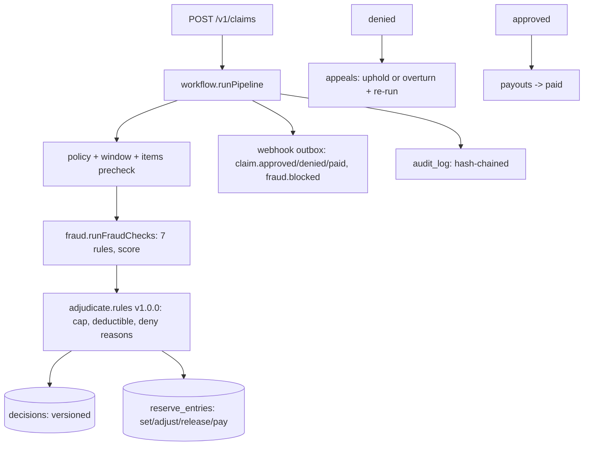

# ClaimCheck

Insurance claims processing engine: intake, validation, fraud checks,
adjudication rules, workflow, reserves, payouts, and appeals — for auto,
health, and property lines.

**Who it's for:** MGAs, TPAs, and carrier modernization teams that need a
deterministic, auditable adjudication core: every decision carries versioned
reasons, every fraud flag cites its rule, and every dollar of reserve is a
running-balance ledger entry.

## Architecture



Auth: per-org API keys (`X-API-Key`, service identity) plus adjuster sessions
(`Authorization: Bearer`, roles adjuster/supervisor). Amounts are integer USD
cents on the wire (`"3200.50"`) and in storage — never float.

## 60-second quickstart

```bash
npm install && npm run build
node dist/cli.js provision-org --name "Acme Mutual"
# {"org_id":"...","api_key":"cc_live_..."}
export KEY=<KEY>
node dist/cli.js serve &
```

Policy, claim, decision:

```bash
curl -s -X POST localhost:8000/v1/policies -H "X-API-Key: $KEY" \
  -H 'Content-Type: application/json' \
  -d '{"policyNumber":"AUTO-001","holderName":"Ada Driver","product":"auto",
       "coverageLimit":"50000","deductible":"1000",
       "effectiveFromMs":1700000000000,"effectiveUntilMs":1800000000000}'
curl -s -X POST localhost:8000/v1/claims -H "X-API-Key: $KEY" \
  -H 'Content-Type: application/json' \
  -d '{"policyNumber":"AUTO-001","claimantName":"Ada Driver",
       "incidentMs":1750000000000,"reportedMs":1750003600000,
       "items":[{"category":"repair","amount":"3200.50"}]}'
# -> {claim:{status:"approved",...}, decision:{outcome:"approve",payableMinor:220050,...}, flags:[], score:0}
```

Or seed a demo org: `node dist/cli.js seed-demo --org-id <ORG>`.

## Design decisions

- **Deterministic pipeline.** Same claim state always yields the same decision
  (`runPipeline`); fraud rules are pure functions over an explicit context.
- **Explainable fraud.** Every flag cites rule code, severity, points, detail;
  `WATCHLIST` blocks, score ≥ 70 goes manual — thresholds are constants, not vibes.
- **Versioned decisions.** Appeals and overrides append decision versions;
  nothing is overwritten.
- **Reserve ledger.** `set/adjust/release/pay` with a running balance guarded by
  code and a `CHECK (balance_after_minor >= 0)` constraint.
- **Transition map.** `TRANSITIONS` in `workflow.ts` is the single source of
  truth; illegal jumps throw `WorkflowError` (422).
- **Idempotency.** Intake and payouts accept `Idempotency-Key` (8–64 chars,
  409 on payload mismatch, exact replay otherwise).
- **Append-only evidence.** Decisions, reserves, flags, audit rows are never
  updated; users are suspended, never deleted.

Config is env-driven with the `CLAIMCHECK_` prefix (`config.ts`). See
`.env.example`.

## API

All `/v1/*` except `/health` and `/v1/login` require `X-API-Key` or a session
token. Errors: 401 bad/missing credentials, 403 supervisor-only, 404
wrong-org/missing, 409 conflict (idempotency mismatch, appeal decided, dup),
422 validation/workflow, 413 oversized body.

| Method | Path | Notes |
| --- | --- | --- |
| GET | `/health` | liveness, no auth |
| POST | `/v1/login` | `{orgId,email,password}` → session token |
| POST | `/v1/logout` | invalidates session |
| GET | `/v1/me` | identity + role |
| POST | `/v1/policies` | dollar-string amounts |
| GET | `/v1/policies` | list (paged) |
| GET | `/v1/policies/:id` | detail |
| POST | `/v1/claims` | intake + full pipeline run |
| GET | `/v1/claims?status=&limit=` | list |
| GET | `/v1/claims/:id` | claim + policy + items + flags + decisions + reserves + payouts + appeals + docs |
| POST | `/v1/claims/:id/documents` | base64, 5MB cap |
| GET | `/v1/claims/:id/documents/:docId` | metadata + base64 |
| POST | `/v1/claims/:id/override` | supervisor, from fraud_review |
| POST | `/v1/claims/:id/pay` | idempotent, partial ok |
| POST | `/v1/claims/:id/appeal` | from denied |
| POST | `/v1/appeals/:id/decide` | supervisor, `{overturn, reason}` |
| GET | `/v1/claims/:id/reserves` | entries + balance |
| GET | `/v1/claims/:id/timeline` | audit + decisions + reserves + payouts |
| POST/GET/DELETE | `/v1/watchlist[/:id]` | fraud watchlist |
| GET | `/v1/audit?since=&limit=` | hash-chained log |
| GET | `/v1/audit/verify` | chain check (409 on tamper) |
| POST | `/v1/adjusters` | supervisor only (bootstrap via CLI) |
| POST | `/v1/webhook-endpoints` | https or http://localhost |
| POST | `/v1/webhooks/dispatch` | deliver due outbox items |

CLI (`node dist/cli.js <cmd>`): `provision-org --name`,
`create-adjuster --org-id --email --name --password --role`,
`serve [--port]`, `seed-demo --org-id`, `report --org-id --claim-id`.
All take `--db` (default `CLAIMCHECK_DATABASE_URL` or `./claimcheck.db`).

## Testing / quality

```bash
npm test        # vitest (34 tests: store, engine, API)
npm run lint    # eslint strictTypeChecked
npm run typecheck  # tsc --noEmit (strict + exactOptionalPropertyTypes + noUncheckedIndexedAccess)
npm run e2e     # live server smoke test
```

## Project layout

```
src/
  app.ts          # express factory, /health, error mapping
  auth.ts         # API keys, sessions, roles
  cli.ts          # provision, adjusters, serve, seed, report
  config.ts       # CLAIMCHECK_* settings
  db.ts           # node:sqlite wrapper, migrations, ids
  http.ts         # auth middleware, idempotency, safe parsers
  money.ts        # integer-cents parsing
  schema.sql      # full schema
  server.ts       # listen entrypoint
  types.ts        # domain types
  webhooks.ts     # outbox + HMAC dispatch
  engine/         # fraud.ts adjudicate.ts workflow.ts
  store/          # policies.ts claims.ts users.ts audit.ts errors.ts
  routes/         # policies.ts claims.ts admin.ts
test/             # store, engine, api suites
```

## Limitations

- **SQLite only** (`node:sqlite`, WAL). No Postgres port; documented, not promised.
- **Single-node.** Concurrency relies on SQLite `BEGIN IMMEDIATE` transactions.
- **USD-only.** Single-currency minor units; FX is out of scope.
- **No document OCR/verification.** Documents are stored with hashes; content
  is not inspected.
- **No rate limiting or lockout.** Passwords are scrypt-hashed; brute-force
  protection belongs at the edge.
- **First adjuster via CLI.** The API cannot bootstrap its own supervisor.
